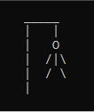
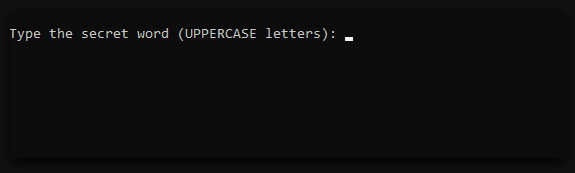
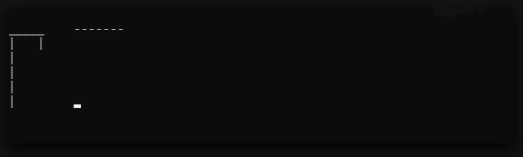

# Hangman C++

The classic Hangman Game made with C++ to console. Play with a friend!

    

## How to play 🕹

Open `hangman.exe`, that executable is the game.

---

**Player 1** - will type the secret word (UPPERCASE letters), and press Enter

**Player 2** - will try to guess the word typing the letters which he thinks be correct. The player has only 5 lifes to do that, be careful.

## Enjoy!

I hope you enjoy the game, it was fully made by me as a challenge to my learning. I like these type of challenges. 😄

Be free to contribute with my learning doing a PR to show your way to do that game.